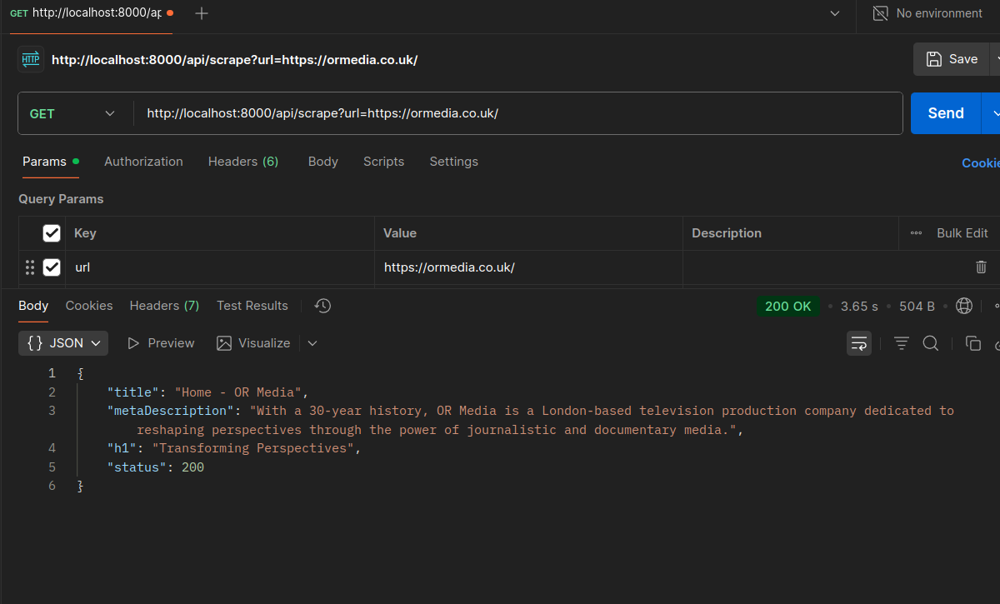

## Task B: Micro Scraper

Clone and Run Project

```bash
git clone https://github.com/4joejoe/micro-scraper.git
cd micro-scraper/
npm i && npm run dev
```

Behavioral features

- Timeout: Implement a 20-second timeout for all requests. ✅
- Page Load: Wait until the network is idle or the document is fully ready. ✅
- Error Handling: Robust validation of URLs and clean error management. ✅

Project implementaion details

- Clean code architecture
- Minimal dependecies (express, puppeteer, tsx)
- Single `GET` Route
  ````bash
  curl --location 'http://localhost:8000/api/scrape?url=https://ormedia.co.uk/'```
  ````
- URL validation and normalization using regex, no external libraries used
- Typesafe implementation

### Screenshot


